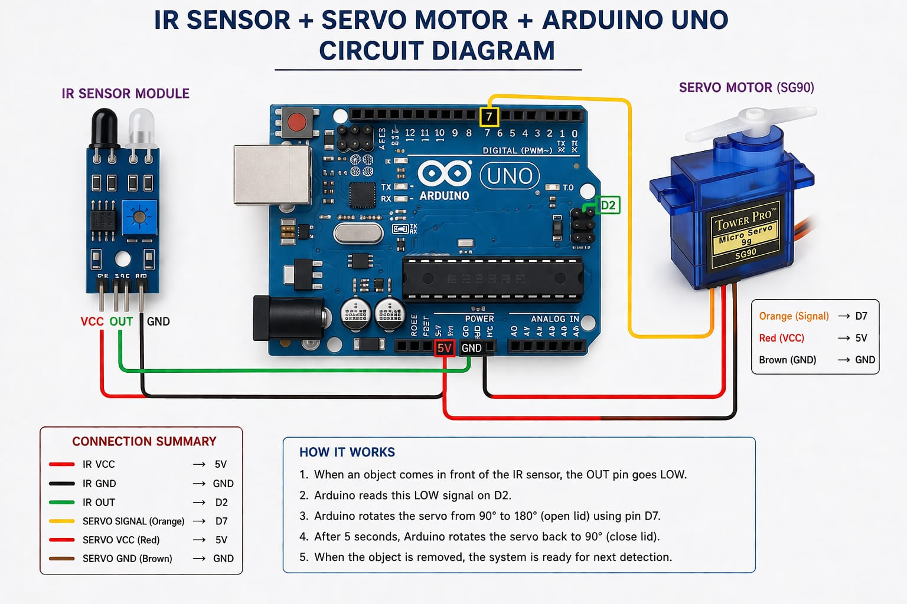
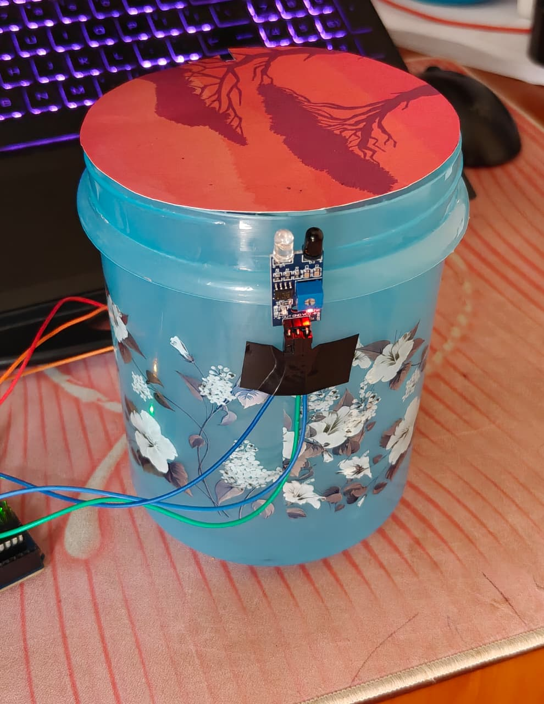
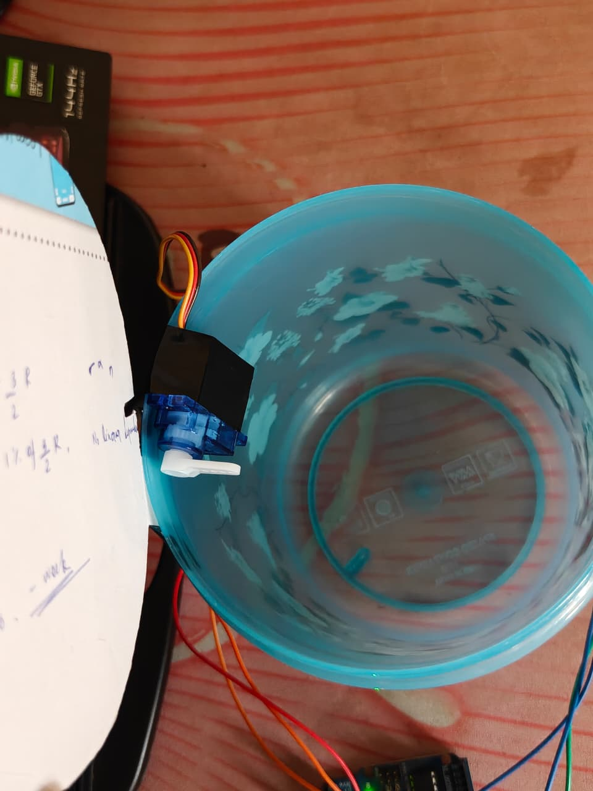
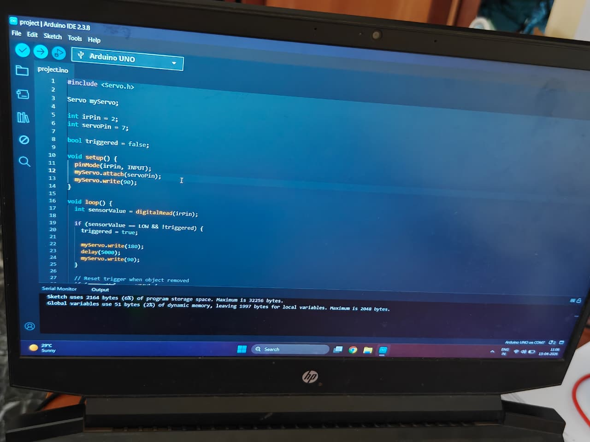
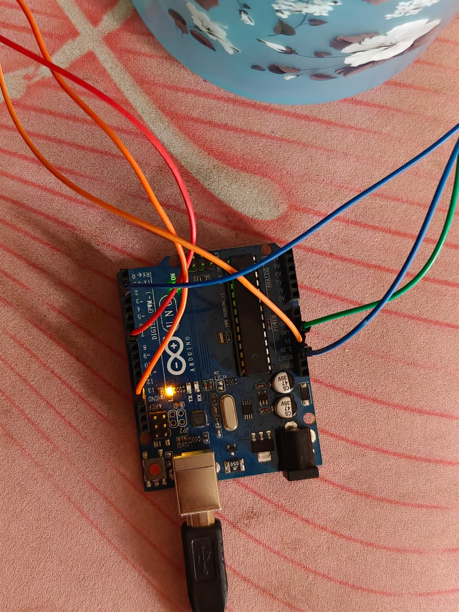
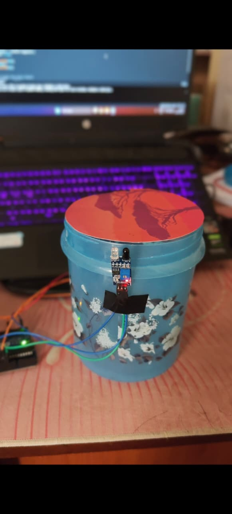
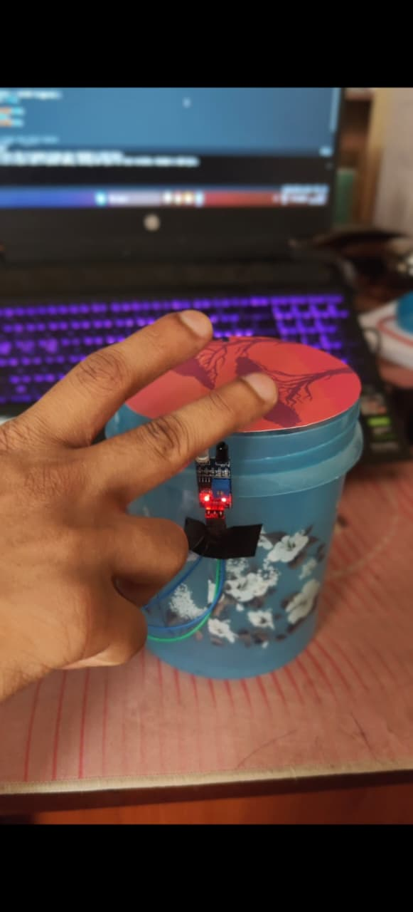
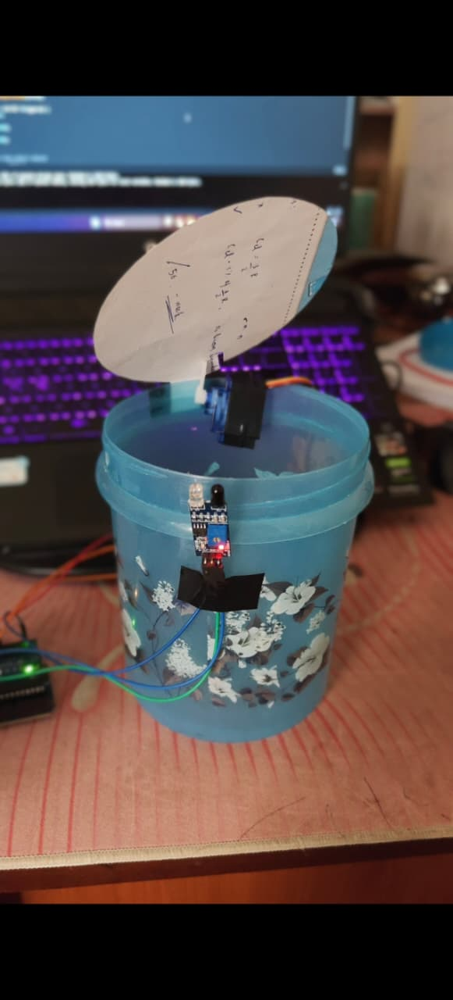

# Smart Dustbin using Arduino, IR Sensor & Servo Motor

An automated, touch-free dustbin that opens its lid automatically when a hand or object is detected — improving hygiene in homes, hospitals, and public spaces.

---

## Table of Contents

- [Overview](#overview)
- [How It Works](#how-it-works)
- [Circuit Diagram & Components](#circuit-diagram--components)
- [Screenshots](#screenshots)
- [Project Demo](#project-demo)
- [Arduino Code](#arduino-code)
- [Setup Guide](#setup-guide)
- [Future Enhancements](#future-enhancements)

---

## Overview

This project implements a **smart, touchless dustbin** using an IR (Infrared) sensor and a servo motor controlled by an **Arduino Uno**. The system detects the presence of a hand or object near the dustbin lid and automatically opens it — no physical contact required.

**Key benefits:**
- Hygienic: eliminates the need to touch a dirty lid
- Cost-effective: uses inexpensive, widely available components
- Simple: easy to build and understand — great for beginners
- Scalable: can be extended with IoT, ultrasonic sensors, and more

---

## How It Works

```
Hand/Object Detected
        |
        v
IR Sensor outputs LOW signal
        |
        v
Arduino reads pin D2 (LOW)
        |
        v
Arduino sends PWM signal to Servo on pin D7
        |
        v
Servo rotates: 90° → 180° (Lid OPENS)
        |
        v
5-second delay (lid stays open)
        |
        v
Servo rotates: 180° → 90° (Lid CLOSES)
        |
        v
Boolean flag resets when object is removed
```

**Step-by-step logic:**

1. The IR sensor continuously monitors for an object in front of the dustbin.
2. When an object is detected, the sensor outputs a **LOW** signal to Arduino pin **D2**.
3. The Arduino checks a boolean flag (`triggered`) to avoid re-triggering while the lid is already open.
4. If not already triggered, the Arduino commands the servo motor to rotate from **90° to 180°**, opening the lid.
5. After a **5-second delay**, the servo returns to **90°**, closing the lid.
6. When the object is no longer detected (sensor goes HIGH), the `triggered` flag resets, ready for the next detection.

---

## Circuit Diagram & Components

### Circuit Overview



### Components Required

| Component | Quantity | Purpose |
|---|---|---|
| Arduino Uno | 1 | Main microcontroller |
| IR Sensor Module | 1 | Detects hand/object presence |
| Servo Motor (SG90) | 1 | Opens and closes the dustbin lid |
| Jumper Wires | ~10 | Electrical connections |
| USB Cable (Type-B) | 1 | Power and programming |
| Dustbin with lid | 1 | Physical enclosure |
| Breadboard (optional) | 1 | Prototyping connections |

### Wiring Connections

| IR Sensor Pin | Arduino Pin |
|---|---|
| VCC | 5V |
| GND | GND |
| OUT | D2 |

| Servo Motor Pin | Arduino Pin |
|---|---|
| VCC (Red) | 5V |
| GND (Brown/Black) | GND |
| Signal (Orange/Yellow) | D7 |

> **Important:** All components must share a **common ground** with the Arduino for stable and reliable operation.

---

## Screenshots

### Project Build

| Front View | Top View |
|---|---|
|  |  |

| Coding Part | Arduino Contoller |
|---|---|
|  |  |

---

## Project Demo

The images below show the smart dustbin in action — from idle state to lid fully open.

| Step 1 — Idle (Lid Closed) | Step 2 — Object Detected (Lid Opening) | Step 3 — Lid Fully Open |
|---|---|---|
|  |  |  |

---

## Arduino Code

The full source code is in [project.ino](project.ino).

```cpp
#include <Servo.h>

Servo myServo;

int irPin = 2;     // IR sensor output connected to digital pin 2
int servoPin = 7;  // Servo signal connected to digital pin 7

bool triggered = false;  // Prevents repeated triggering while lid is open

void setup() {
  pinMode(irPin, INPUT);
  myServo.attach(servoPin);
  myServo.write(90);  // Initial position: lid closed
}

void loop() {
  int sensorValue = digitalRead(irPin);

  if (sensorValue == LOW && !triggered) {
    triggered = true;

    myServo.write(180);  // Open lid
    delay(5000);         // Keep open for 5 seconds
    myServo.write(90);   // Close lid
  }

  // Reset trigger when object is removed
  if (sensorValue == HIGH) {
    triggered = false;
  }
}
```

### Code Explanation

| Part | Description |
|---|---|
| `#include <Servo.h>` | Includes the Arduino Servo library to control the servo motor |
| `irPin = 2` | Digital pin D2 reads the IR sensor output |
| `servoPin = 7` | Digital pin D7 sends PWM signal to the servo |
| `triggered` flag | Boolean that prevents the lid from repeatedly opening while an object is still in front |
| `myServo.write(90)` | Sets servo to 90° — lid closed position |
| `myServo.write(180)` | Sets servo to 180° — lid open position |
| `delay(5000)` | Keeps the lid open for 5 seconds before closing |

---

## Setup Guide

### Software Requirements

| Tool | Purpose | Download |
|---|---|---|
| Arduino IDE | Write, compile, and upload code | [arduino.cc/en/software](https://www.arduino.cc/en/software) |
| Servo.h Library | Built-in Arduino library — no installation needed | Pre-installed with Arduino IDE |
| USB Driver (CH340) | Required if Arduino is a clone board | Search "CH340 driver" for your OS |

### Hardware Requirements

- Arduino Uno (or compatible clone)
- IR Sensor module (FC-51 or similar)
- SG90 Servo Motor
- Jumper wires (male-to-male and male-to-female)
- USB Type-B cable
- A dustbin with a hinged lid

### Step-by-Step Setup

**1. Install Arduino IDE**
- Download and install the Arduino IDE from the official website.
- Connect your Arduino Uno via USB.
- In the IDE, go to **Tools > Board** and select **Arduino Uno**.
- Go to **Tools > Port** and select the correct COM port.

**2. Wire the Components**
- Connect the IR sensor: VCC → 5V, GND → GND, OUT → D2.
- Connect the servo motor: Red → 5V, Black/Brown → GND, Signal → D7.
- Ensure all GND connections share a common ground on the Arduino.

**3. Adjust IR Sensor Sensitivity**
- Power the circuit and place your hand in front of the IR sensor.
- Use the small potentiometer (blue screw) on the sensor module to adjust detection range.
- The sensor LED should light up when an object is detected.

**4. Upload the Code**
- Open `project.ino` in the Arduino IDE.
- Click the **Upload** button (right arrow icon).
- Wait for "Done uploading" confirmation in the status bar.

**5. Attach the Servo to the Dustbin Lid**
- Mount the servo motor to the side or hinge of the dustbin.
- Attach a lever arm or rod from the servo horn to the lid.
- Test manually by running the code and triggering the sensor.

**6. Power Options**
- Via USB from a computer or USB wall adapter (5V).
- Via a 9V battery connected to the Arduino's barrel jack (barrel jack input is regulated down to 5V internally).

---

## Future Enhancements

This project can be extended significantly with additional sensors and features:

### Sensor Upgrades

| Sensor | Benefit |
|---|---|
| **Ultrasonic Sensor (HC-SR04)** | More accurate distance detection; works in sunlight where IR may fail |
| **PIR Motion Sensor** | Detects body heat — useful for larger detection zones |
| **Load Cell / Weight Sensor** | Measure how full the dustbin is and alert when it needs emptying |
| **MQ-135 Gas / Smell Sensor** | Detect odor levels inside the bin and trigger ventilation or alerts |
| **Capacitive Touch Sensor** | Allow manual tap-to-open as a fallback |

### Connectivity & IoT Features

| Feature | Description |
|---|---|
| **ESP8266 / ESP32 Wi-Fi Module** | Send bin-full alerts to a phone or dashboard via Wi-Fi |
| **Blynk / MQTT Integration** | Monitor dustbin status remotely through a mobile app |
| **GSM Module (SIM800L)** | SMS alerts when the bin is full — works without Wi-Fi |
| **Firebase / ThingSpeak** | Log fill level over time for waste management analytics |

### Physical & UX Improvements

| Feature | Description |
|---|---|
| **LCD / OLED Display** | Show bin status (Open / Closed / Full) locally |
| **Buzzer Alert** | Beep when the bin is full and needs emptying |
| **LED Indicator** | Green = ready, Red = full, Yellow = lid open |
| **Battery + Solar Power** | Make the system fully wireless and self-sustaining |
| **Automatic Bag Dispenser** | Dispense a new garbage bag automatically when the old one is removed |

---

## Applications

- **Homes** — Hygienic kitchen and bathroom bins
- **Hospitals** — Critical for infection control and sterile environments
- **Public Places** — Offices, malls, airports with high foot traffic
- **Restaurants** — Food waste disposal without cross-contamination

---

## License

This project is open-source and free to use for educational and personal purposes.
